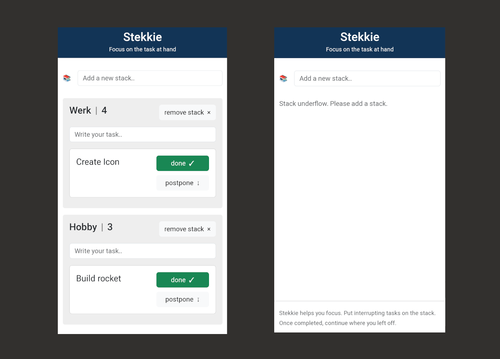

# About Stekkie

Stekkie is a simple app that let's you focus on a single task for each context. 

For each context there is a stack of tasks, you get to see the top task. You can postpone it, or mark it done. 

It's a Progressive Web App (PWA), so basically a website with some mobile app capabilities. The main advantage is that it keeps working while you are offline.

# Download the app

- Google Play store: https://play.google.com/store/apps/details?id=nl.fitchef.stekkie
- Apple App Store: https://apps.apple.com/nl/app/stekkie/id6447972185

# Run locally

PORT=3001 npm start

# Feedback

Let us know what you think!

# Developer guide

## Release update

Push to 'main' branch will automatically update https://stekkie.herokuapp.com

## Build for Android / iOS

https://www.pwabuilder.com

- Build using web interface
- iOS upload via XCode 'archive' 
- Android
  - Locally 'adb install' 
    adb install -r ./PWA-T.apk
  - Upload online via Google Developer Console website.

## Android keystore

The keystore is created via pwabuilder.com,
It is a secret that should not be part of the repo.

# Screenshot

